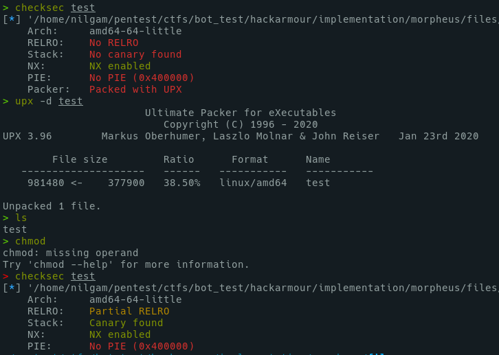
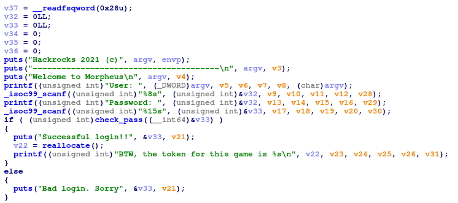
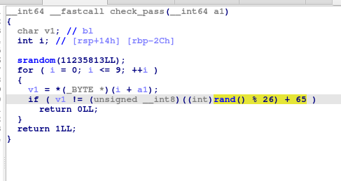
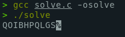
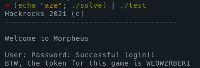

# Morpheus

	Below you will find the authentication module, which is an exact copy of the existing one on the server, 
    and which we have prepared so that it can be run directly.

	Let's get started!

# Pwn

First, we have a UPX packed file. Let's unpack it.



Let's check into IDA.





We can notice an important thing in this last piece of code : `srandom(11235813)`
This is a critical programming error. As the seed of srandom is initialized with a static value, the sequence generated by this function will always be the same.

As it, we can easily reverse this function with a short C program.

```c
#include <stdio.h>
#include <stdlib.h>

int main()
{
    srandom(11235813);
    int i = 0;
    for ( i = 0; i <= 9; ++i )
    {
    printf("%c", (rand() % 26) + 65);
    }

    printf("\n");

    return 0;
}
```





## Flag

    WEOWZRBERI