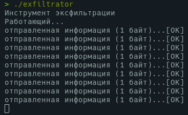
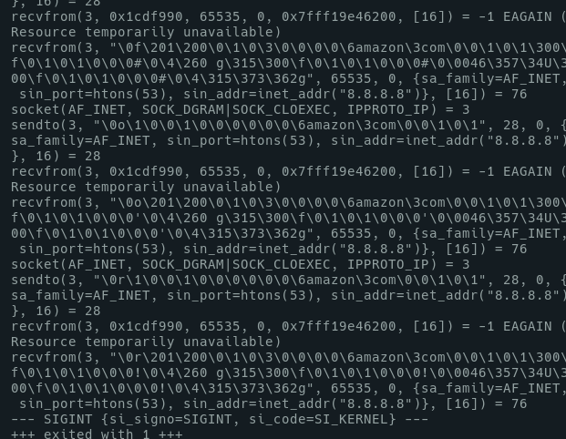
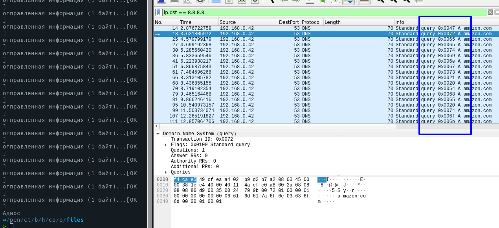
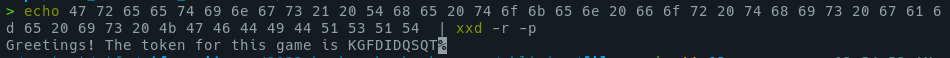

# Oblivion

	Again, below you will find the executable we have been able to retrieve... We think it is exfiltrating some kind of information, but we are not sure which one, or how...

	Can you solve the challenge?


## Solution
When I ran the binary the first time, plus the name of the category of challenge, which is "connection", I immediately thought about a network connection, sending data somewhere else.



Then, to check than with commandline, I run, aside the running binary, the following command : 

```
./exfiltrator&; strace -f -e trace=network -s 10000 -p $(ps a | egrep "./exfiltrator" | tr -s ' ' | cut -d ' ' -f 2 | head -n1)
```



We see that packets are sent to `8.8.8.8`

Running the binary with Wireshark aside, we notice a weird data in packets :



which give us 

```
47 72 65 65 74 69 6e 67 73 21 20 54 68 65 20 74 6f 6b 65 6e 20 66 6f 72 20 74 68 69 73 20 67 61 6d 65 20 69 73 20 4b 47 46 44 49 44 51 53 51 54 
```

Then 



```
Greetings! The token for this game is KGFDIDQSQT
```

## Flag

	KGFDIDQSQT
