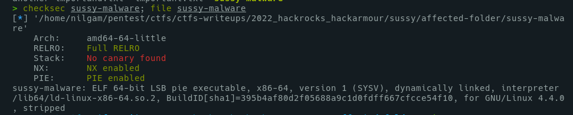
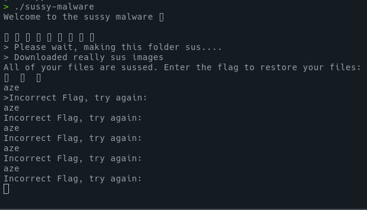
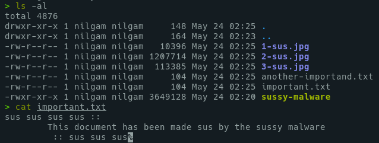
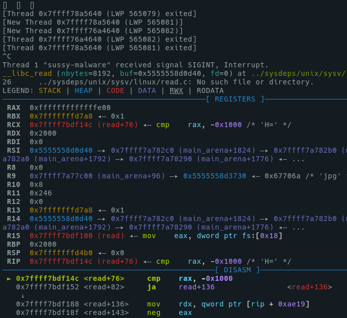
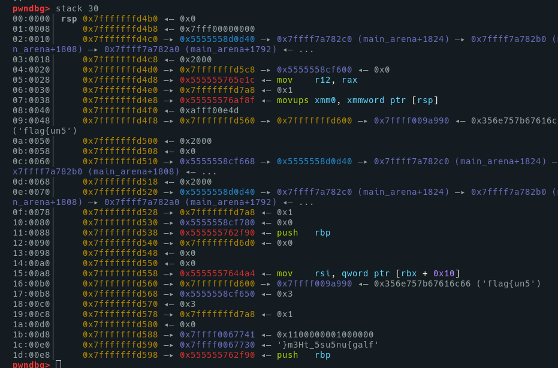
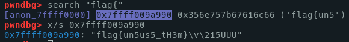
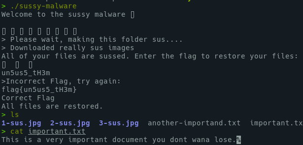

# Sussy

	Just a binary to analyze. Do you accept the challenge....?

<!-- MarkdownTOC -->

- [Solution](#solution)
	- [Diggin in GDB](#diggin-in-gdb)
- [Flag](#flag)

<!-- /MarkdownTOC -->

## Solution

We start with a .zip file, containing a README.txt, describing the "malware", and a folder, containing 2 .txt files, and the sussy-malware ELF.

So checksec mitigations are not so useful, on this case, as it's more a reverse challenge than a pwn one.
But one detail triggered me : It's a stripped ELF. So no function symbol...

Let's run it a first time : 

On another shell we can check also files from the same directory :

Then, this malware replace contents of our files... And we have some tries to input the password. Okay, let's dig it into GDB.

### Diggin in GDB

As we have seen above, it's a stripped file, so we don't have any binary function symbols into Gdb.

I admit that I was lucky, cause basically I had a primitive approach : 

- Run the binary into GDB
- Break when the program asks an input
- Step by step until the cmp instruction

And it worked more quickly than I thought.

First, breaking on the read() function, asking us the password : 

Then looking at the stack content, just to see : 

Uh... Magically, get what seems to be the flag.

Then, using pwndbg `search` command to get the entire string :

	flag{un5us5_tH3m}

So, what if we input this password into the binary ?

## Flag

	flag{un5us5_tH3m}