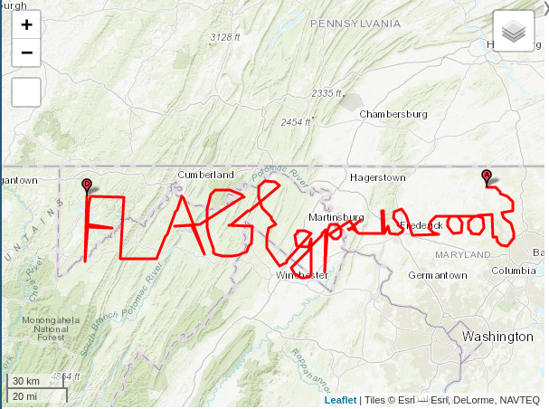

# Wild Ride

## Table of Content

<!-- MarkdownTOC -->

- [Crack the zip !](#crack-the-zip-)
- [Concat pins in map](#concat-pins-in-map)
- [Look at this nice flag !](#look-at-this-nice-flag-)

<!-- /MarkdownTOC -->

## Crack the zip !

As first step, we get a zip file, password protected.
To go over that, we need to crack it.
I use fcrackzip, as one of the fastest zip cracker.

```sh
> fcrackzip gpx.zip -v -D -p rockyou.txt
found file 'ride_1025285.gpx', (size cp/uc   5835/  5823, flags 9, chk b4b8)
found file 'ride_1079822.gpx', (size cp/uc   5831/  5819, flags 9, chk b4b9)
found file 'ride_1092251.gpx', (size cp/uc   5838/  5826, flags 9, chk b4b8)
found file 'ride_1103221.gpx', (size cp/uc   5843/  5831, flags 9, chk b4b8)
found file 'ride_1215868.gpx', (size cp/uc   5838/  5826, flags 9, chk b4b8)
found file 'ride_130107.gpx', (size cp/uc   5836/  5824, flags 9, chk b4b8)
found file 'ride_1378691.gpx', (size cp/uc   5834/  5822, flags 9, chk b4b8)
found file 'ride_1420835.gpx', (size cp/uc   5842/  5830, flags 9, chk b4b8)
8 file maximum reached, skipping further files
possible pw found: crackme ()
```

```sh
> unzip gpx.zip -d gpx_files/
Archive:  gpx.zip
[gpx.zip] ride_1025285.gpx password: crackme
```

We get then 252 gpx files, which is of course too much to look at them manually.

## Concat pins in map

From all these files, we need to transform them into one big GPX file to be able to import it into Ga GPX Viewer.

For this step, I found a nice website : [gotoes.org](https://gotoes.org/strava/Combine_GPX_TCX_FIT_Files.php)
Note : This one require a non-protected zip file if we get too much files.
To do that : 

```sh
zip -r gpx_files.zip gpx_files
```

Then, upload the zip file, then download the new one, merged.

## Look at this nice flag !

[GPX-view works well](https://www.gpx-view.com/)



It's ugly, but readable (or almost :D )
	
	flag{gpx_is_cool}

